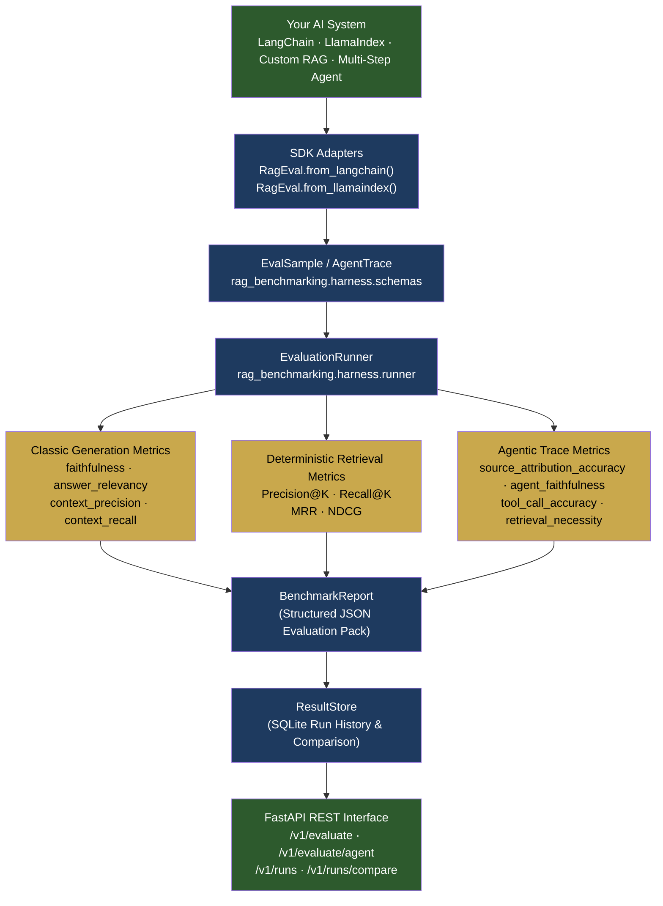
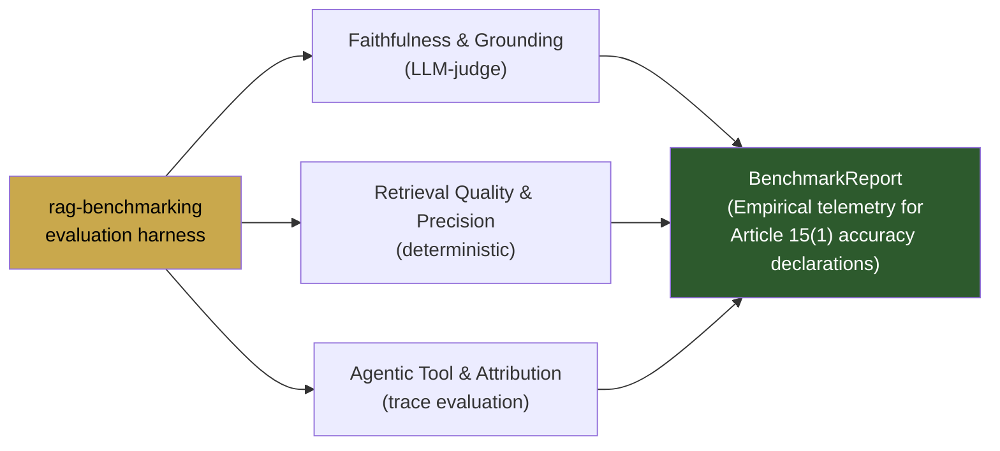
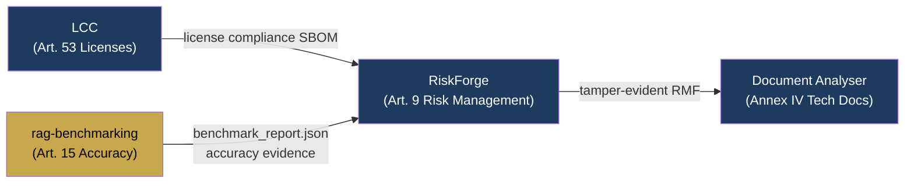

<div align="center">
  <picture>
    <source media="(prefers-color-scheme: dark)" srcset="https://raw.githubusercontent.com/aiexponent/rag-benchmarking/main/.github/brand/og.png">
    <source media="(prefers-color-scheme: light)" srcset="https://raw.githubusercontent.com/aiexponent/rag-benchmarking/main/.github/brand/og.png">
    
  </picture>
  <h1 align="center">RAG Benchmarking</h1>
  <p align="center"><em>Framework-agnostic evaluation harness for RAG and agentic AI systems.</em></p>
  <p align="center">
    <a href="https://pypi.org/project/rag-benchmarking/"></a>
    <a href="https://github.com/aiexponent/rag-benchmarking/actions"></a>
    <a href="LICENSE"></a>
    <a href="https://www.python.org/downloads/"></a>
    <a href="https://eur-lex.europa.eu/legal-content/EN/TXT/?uri=CELEX:32024R1689"></a>
    <a href="#privacy"></a>
  </p>
</div>

---

> **RAG Benchmarking provides empirical, deterministic accuracy and faithfulness evidence for EU AI Act Article 15 (Accuracy, Robustness, Cybersecurity) and Annex IV technical documentation. Apache 2.0, AS IS.**
>
> A framework-agnostic evaluation harness for LangChain, LlamaIndex, or custom RAG and agentic pipelines. Measures classic retrieval and generation quality alongside agentic tool-use fidelity, outputting structured JSON benchmark reports and SQLite run histories. Built for teams who must verify and prove AI system performance before deployment.

---

## The Problem

Under the EU AI Act ([Regulation (EU) 2024/1689](https://eur-lex.europa.eu/legal-content/EN/TXT/?uri=CELEX:32024R1689)), providers and deployers of **high-risk AI systems** (governed by Article 6 and Annex III) face mandatory statutory obligations under **Article 15 (Accuracy, Robustness, and Cybersecurity)**:

* **Statutory Requirement**: High-risk AI systems must achieve appropriate levels of accuracy, robustness, and cybersecurity, and perform consistently throughout their lifecycle. Declared metrics and levels of accuracy must be documented in technical documentation (Annex IV) and instructions for use (Article 13).
* **Statutory Non-Compliance Penalties**: Fines up to **€15,000,000 or 3% of total worldwide annual turnover** under Article 99(4).
* **The Hallucination & Evidence Deficit**: Teams deploying RAG or autonomous agentic workflows struggle to prove that retrieved context is grounded, citations are truthful, and tools are called accurately across system updates.

**RAG Benchmarking** provides the empirical evaluation infrastructure:

> *"How do we measure, benchmark, and mathematically verify accuracy and faithfulness across model migrations and retrieval changes?"*

Bring your own RAG or agent pipeline. Evaluate against 12+ classic and agentic-era metrics across curated golden datasets. Output audit-ready benchmark reports with zero telemetry.

Built by [AI Exponent LLC](https://aiexponent.com). Apache 2.0. Runs entirely offline or via local API service after `pip install`.

---

## Quick Start

### 1. Installation

```bash
pip install rag-benchmarking
```

### 2. Python SDK Evaluation

```python
from rag_benchmarking import RagEval

# Initialize evaluation client
client = RagEval(api_url="http://localhost:5001", api_key="your-key")

# Works with LangChain
# result = my_chain.invoke({"query": "What is Article 15?"})
# sample = RagEval.from_langchain(result)

# Or any standard dictionary with question / contexts / answer
sample = {
    "question": "What documentation must high-risk AI system deployers maintain under Article 26?",
    "contexts": [
        "Article 26(5) requires deployers of high-risk AI systems to keep system logs for at least six months."
    ],
    "answer": "Deployers must keep logs generated by high-risk AI systems for at least six months where appropriate.",
}

# Run benchmark evaluation
report = client.evaluate([sample], metrics=["faithfulness", "answer_relevancy"])
print(report["metrics"])
# Output: {"faithfulness": 0.962, "answer_relevancy": 0.845}
```

### 3. Evaluate Agentic Traces

```python
from rag_benchmarking import RagEval

client = RagEval(api_url="http://localhost:5001", api_key="your-key")

trace = {
    "question": "What is the GPAI compliance deadline under Article 111?",
    "final_answer": "Obligations for general-purpose AI models apply from 2 August 2025.",
    "tool_calls": [
        {
            "tool_name": "eu_act_search",
            "tool_input": {"query": "GPAI deadline Article 111"},
            "tool_output": "Chapter V obligations apply from 2 August 2025.",
            "step_index": 0,
        }
    ],
}

report = client.evaluate_agent(trace, metrics=["source_attribution_accuracy", "tool_call_accuracy"])
print(report["metrics"])
```

### 4. Running the Evaluation Server

```bash
# Clone the repository
git clone https://github.com/aiexponent/rag-benchmarking.git
cd rag-benchmarking

# Start the evaluation server & vector store
docker compose up -d

# OpenAPI docs available at: http://localhost:5001/docs
```

---

## Architecture



---

## Supported Evaluation Metrics

### 1. Generation & RAG Quality Metrics

| Metric | Description | Evaluator Type |
| :--- | :--- | :--- |
| `faithfulness` | Measures factual consistency of the answer against retrieved context (hallucination detection) | LLM Judge |
| `answer_relevancy` | Measures whether the generated answer directly addresses the original question | LLM Judge |
| `context_precision` | Measures whether ground-truth relevant chunks are ranked higher in retrieved context | LLM Judge |
| `context_recall` | Measures whether retrieved context contains all facts required to answer the question | LLM Judge |

### 2. Deterministic Retrieval Metrics

| Metric | Description | Evaluator Type |
| :--- | :--- | :--- |
| `precision_at_k` | Proportion of top-K retrieved documents that are relevant | Deterministic |
| `recall_at_k` | Proportion of all relevant documents captured in top-K retrieval | Deterministic |
| `mrr` | Mean Reciprocal Rank of the first relevant retrieved document | Deterministic |
| `ndcg_at_k` | Normalized Discounted Cumulative Gain accounting for position relevance | Deterministic |

### 3. Agentic-Era Trace Metrics

| Metric | Description | Evaluator Type |
| :--- | :--- | :--- |
| `source_attribution_accuracy` | Verifies whether citations match actual retrieved chunk identifiers | Deterministic |
| `agent_faithfulness` | Evaluates factual grounding across every intermediate reasoning step | LLM Judge |
| `tool_call_accuracy` | Verifies whether the agent selected appropriate tools for the sub-task | LLM Judge |
| `retrieval_necessity` | Measures whether external retrieval was genuinely required or superfluous | LLM Judge |

### Metric Groups
Evaluate pre-configured metric suites with a single parameter:
```python
report = client.evaluate(samples, metric_group="classic")      # faithfulness, answer_relevancy, context_precision, context_recall
report = client.evaluate(samples, metric_group="retrieval")    # precision@k, recall@k, mrr, ndcg@k
report = client.evaluate(samples, metric_group="agentic_v1")   # source_attribution, agent_faithfulness, tool_accuracy
report = client.evaluate(samples, metric_group="full")         # all supported metrics
```

---

## EU AI Act Article 15 — Empirical Evidence Scope

`rag-benchmarking` is an **evaluation harness** that provides empirical accuracy and faithfulness measurements for RAG and agentic AI systems. Those metrics serve as critical input to Article 15 technical documentation, but do **not** constitute conformity assessment by themselves.



### What this tool covers
* **Article 15(1) — Declared accuracy metrics in instructions for use**: Produces reproducible accuracy and faithfulness benchmarks that providers cite in technical documentation (Annex IV §2(b)) and instructions for use (Article 13).

### What this tool does NOT cover
* **Article 15 Robustness**: Robustness under the EU AI Act entails adversarial input testing, out-of-distribution resilience, and perturbation analysis. (A faithfulness scorer is not an adversarial robustness test).
* **Article 15 Cybersecurity**: Jailbreak resistance, prompt injection defenses, and pipeline security require dedicated runtime defenses.
* **Conformity Assessment**: High-risk AI systems require formal conformity assessment procedures under Article 43. Benchmark reports provide supporting technical evidence, not regulatory certification.

---

## AiExponent Ecosystem Integration

`rag-benchmarking` integrates directly into the AiExponent regulatory compliance toolchain:



---

## Configuration

Configure environment variables via `.env`:

```bash
# LLM Judge Provider
LLM_PROVIDER=gemini              # gemini (recommended) or openai
GEMINI_API_KEY=your-gemini-key
OPENAI_API_KEY=your-openai-key

# Optional Vector Store (for built-in RAG pipeline)
QDRANT_URL=https://your-cluster.qdrant.io
QDRANT_API_KEY=your-qdrant-key

# API Authentication & Security
API_KEY=your-secure-api-key
ENFORCE_API_KEY=true
```

---

## Project Structure

```
src/
  rag_benchmarking/
    __init__.py          # Public exports (RagEval, EvaluationRunner, ResultStore, ...)
    sdk/                 # Dedicated SDK entrypoint (from rag_benchmarking.sdk import RagEval)
    harness/             # Framework-agnostic benchmark harness
      schemas.py         # EvalSample, AgentTrace, BenchmarkReport, RunConfig
      protocol.py        # RAGEvaluable Protocol — plug-in interface
      runner.py          # EvaluationRunner — metric orchestration
      result_store.py    # SQLite persistence & run comparisons
    app/
      api/               # FastAPI endpoints (/v1/evaluate, /v1/runs)
      eval/              # RAGAS and custom metric runners
      retrieval/         # Chunking, embeddings, Qdrant store, reranker
      engine/            # RAGEngine reference implementation
      llm/               # Unified LLM client (OpenAI & Gemini)
      config/            # Pydantic settings & environment configuration
data/
  golden/qa.jsonl        # 50-sample golden evaluation dataset (10 domains)
```

---

## Releases

| Version | Highlights |
|---|---|
| **[v1.0.2](https://github.com/aiexponent/rag-benchmarking/releases/tag/v1.0.2)** | Namespace isolation (`rag_benchmarking`), unmasked CI quality gates (`mypy`, `pip-audit`, `lcc`), Contributor Covenant 2.1 Code of Conduct with 48h SLA, modernized Contributing guide, dynamic metadata versioning, direct `aiexponent` URLs, 5-tool reciprocal footer, flat-square badges, and Dependabot. |
| [v1.0.1](https://github.com/aiexponent/rag-benchmarking/releases/tag/v1.0.1) | Agent endpoint shape parity (`scores` → `metrics`), SDK plural `ground_truths` docstring alignment, Gemini 2.5 Flash default. |
| [v1.0.0](https://github.com/aiexponent/rag-benchmarking/releases/tag/v1.0.0) | Production baseline release: Path A reframing, schema reconciliation, authenticity pass, 50-sample golden dataset. |

---

## Contributing

We welcome community contributions! Please review [CONTRIBUTING.md](CONTRIBUTING.md) for local setup, commit conventions, and testing instructions.

```bash
git clone https://github.com/aiexponent/rag-benchmarking.git
cd rag-benchmarking
pip install -e ".[test,lint]"
make lint
make test
```

---

## License

[Apache 2.0](LICENSE) — free to use, modify, and distribute.

Built by [AI Exponent LLC](https://aiexponent.com) — `hello@aiexponent.com`

---

*Part of the AiExponent open-source AI governance toolchain:*  
[litmusai](https://github.com/aiexponent/litmusai) (Art. 5) · 
[license-compliance-checker](https://github.com/aiexponent/license-compliance-checker) (Art. 53) · 
**rag-benchmarking** (Art. 15) · 
[riskforge](https://github.com/aiexponent/riskforge) (Art. 9) · 
[agentic-document-analyser](https://github.com/aiexponent/agentic-document-analyser) (Art. 9 / Annex IV)

---

<div align="center">
  <sub>
    <a href="https://aiexponent.com">aiexponent.com</a> ·
    <a href="mailto:hello@aiexponent.com">hello@aiexponent.com</a> ·
    Built in the open · Apache 2.0
  </sub>
</div>
